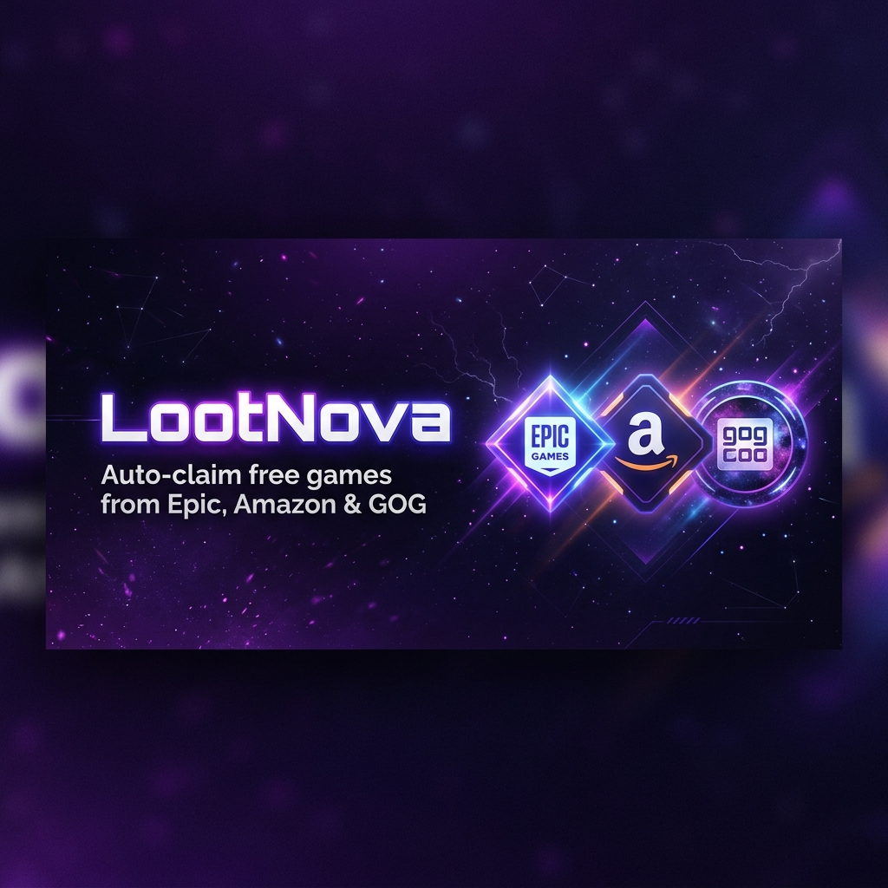

# 🎮 LootNova

<div align="center">
  

  <br/>
  <br/>

  **Automatically claim free games from Epic Games, Amazon Prime Gaming and GOG — without lifting a finger.**

  <br/>

  
  
  
  
  
  

</div>

---

## ✨ Features

| Feature | Description |
|---|---|
| 🤖 **Auto-Claim** | Automatically claims free games on a configurable schedule |
| ⚡ **Manual Claim** | One-click instant claiming for all available games |
| 🛍️ **Multi-Platform** | Supports Epic Games, Amazon Prime Gaming, and GOG |
| ⏱️ **Countdown Timers** | Live timers showing when each free game expires |
| 📜 **Claim History** | Track every game you've claimed, with date and platform |
| 🔔 **Push Notifications** | Get notified when new free games are detected |
| 🌐 **i18n Support** | Available in English and Spanish |
| 🎨 **Modern UI** | Beautiful dark-themed popup with smooth animations |
| 🔑 **Login Status** | Shows your connection status per platform |

---

## 🎯 Supported Platforms

<div align="center">

| Platform | Auto-Claim | Games List | Login Status |
|---|:---:|:---:|:---:|
| 🟣 Epic Games | ✅ | ✅ | ✅ |
| 🟠 Amazon Prime Gaming | ✅ | ✅ | ✅ |
| ⚪ GOG | ✅ | ✅ | ✅ |

</div>

---

## 🚀 Getting Started

### Prerequisites

- **Node.js** v18 or higher
- **npm**

### Installation

```bash
# 1. Clone the repository
git clone https://github.com/adonyrd127-cloud/loot-nova.git
cd loot-nova/wxt-dev-wxt

# 2. Install dependencies
npm install

# 3. Start development server
npm run dev -- --browser=chrome
# or for Firefox:
npm run dev -- --browser=firefox
```

### Build for Production

```bash
# Chrome
npx wxt build --browser=chrome

# Firefox
npx wxt build -b firefox --mv3
```

### Load the Extension

1. Go to `chrome://extensions/` (or `about:debugging` in Firefox)
2. Enable **Developer Mode**
3. Click **Load unpacked** and select the `dist/` folder

---

## 🕹️ How to Use

1. **Open the popup** by clicking the LootNova icon in your browser toolbar
2. **Log in** to each platform you want to use (Epic, Amazon, GOG)
3. **Enable platforms** in the Settings tab
4. **Set your claim frequency** — from every hour to once daily
5. Sit back and let LootNova claim free games for you automatically!

### Claim Frequencies

| Option | Description |
|---|---|
| 🚀 On Browser Start | Claims only when browser launches |
| ⏰ Every Hour | Checks & claims every 60 minutes |
| 🕕 Every 6 Hours | Checks & claims every 6 hours |
| 🕛 Every 12 Hours | Checks & claims every 12 hours |
| 📅 Once Daily | Checks & claims once per day (default) |

---

## 🛠️ Tech Stack

- **[WXT](https://wxt.dev/)** — Web Extension Toolkit (build framework)
- **[React 19](https://react.dev/)** — UI components
- **TypeScript** — Type-safe codebase
- **Browser APIs** — `storage`, `tabs`, `scripting`, `alarms`, `notifications`
- **i18n** — Built-in Chrome/Firefox internationalization (`_locales`)

---

## 📁 Project Structure

```
loot-nova/
└── wxt-dev-wxt/
    ├── entrypoints/
    │   ├── background.ts          # Main orchestrator & alarm scheduler
    │   ├── epic.content.ts        # Epic Games claiming logic
    │   ├── amazon.content.ts      # Amazon Prime Gaming claiming logic
    │   ├── steam.content.ts       # Steam claiming logic
    │   ├── components/
    │   │   ├── GamesList.tsx      # Games list with countdown timers
    │   │   ├── History.tsx        # Claimed games history tab
    │   │   ├── Settings.tsx       # Platform & frequency settings
    │   │   ├── LoginStatus.tsx    # Per-platform login indicators
    │   │   └── ...
    │   ├── popup/                 # Extension popup (App.tsx, styles)
    │   └── types/                 # Shared TypeScript types
    └── public/
        ├── icon/                  # Extension icons
        └── _locales/              # i18n files (en, es)
```

---

## 🌐 Internationalization

LootNova supports multiple languages. Currently available:

- 🇺🇸 English (`en`)
- 🇪🇸 Spanish (`es`)

---

## 📄 License

This project is licensed under the **MIT License** — see the [LICENSE](./LICENSE) file for details.

---

<div align="center">
  Made with ❤️ by <strong>adonyrd127-cloud</strong>
  <br/>
  <em>Never miss a free game again.</em>
</div>
